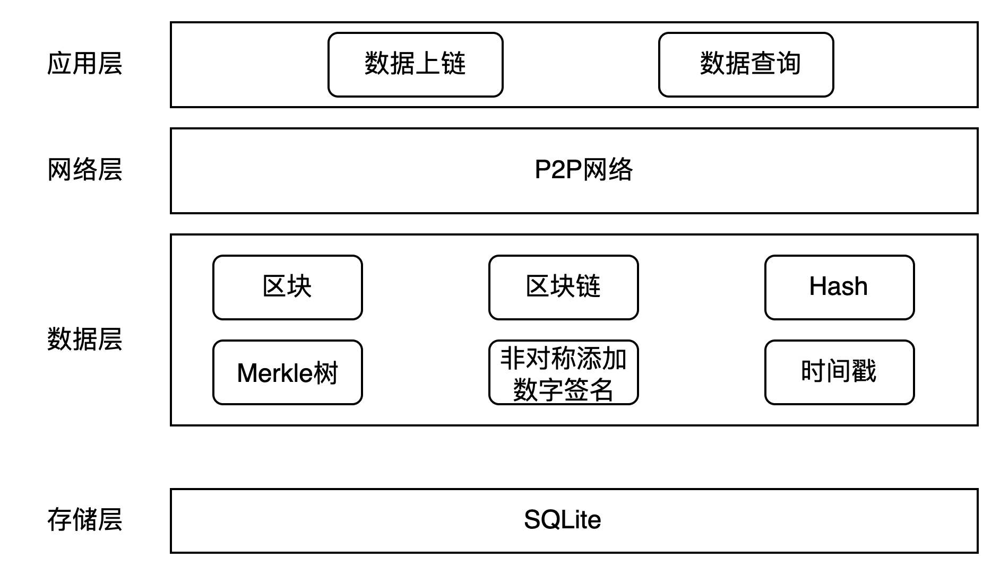
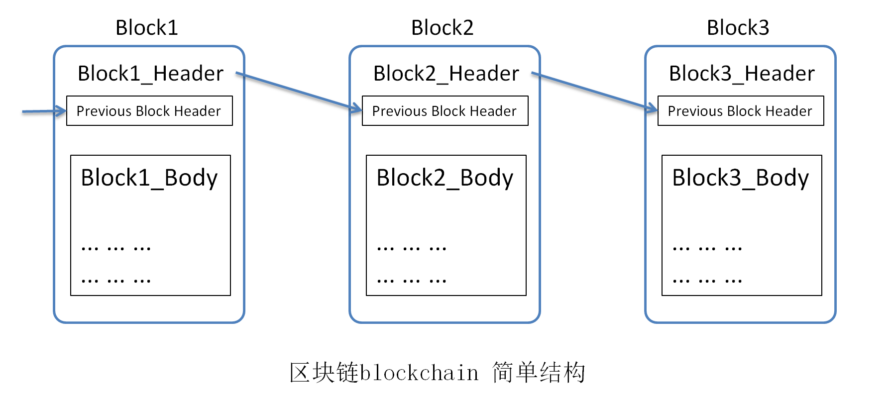

# Design and Implementation of Blockchain Access Optimization Based on Caching Mechanism
## Thinking
The focus of this project is to optimize the underlying structure of the blockchain. Therefore, the consensus layer of the blockchain has been removed, with a focus solely on the design and optimization of the blockchain's underlying architecture. Here, we are not implementing "distributed" but instead concentrating solely on the data storage aspect.
## 1. Traditional Blockchain System
### Traditional Blockchain Architecture
As shown in the diagram, the incomplete traditional blockchain architecture has its consensus layer removed in this project, focusing solely on the underlying structure of the blockchain system. 
**Storage Layer**：The storage layer is primarily used for storing content related to transactions. In this project, RocksDB is employed to store the data of blocks and transaction content. 
**Data Layer**：The data layer is mainly responsible for handling various types of data in transactions, such as packaging data into blocks, maintaining blocks in a chained structure, and performing encryption and hashing calculations on the contents of blocks.
The digital signature of block contents, along with adding a timestamp imprint, involves constructing transaction data into a Merkle tree and computing the hash value of the Merkle tree root node, among other tasks. 
**Internet Layer**：The network layer primarily provides the underlying support for achieving consensus and data communication. In a blockchain, each node serves as both the sender and receiver of data. In this project, we disregard communication between nodes in the blockchain network and focus solely on the underlying structure of the blockchain, thus making the project's structure clearer and more organized. 
**Application layer**：The application layer mainly includes applications for users to transmit data (data on-chain) and perform data queries (such as blockchain traceability and information retrieval).
### Traditional Blockchain Storage Method
#### Data layer (block) design
 
A Block consists of BlockHeader, BlockBody, and BlockHash. BlockHeader represents the header of the block, which contains PreviousHash pointing to the parent block, thus linking all blocks. Nonce (The random number) in it is related to data mining. Since this project does not involve this aspect, this variable is hidden. BlockHeader also includes a list of transaction hashes TransactionList of all transactions in the block, stored in order. In addition, the header also contains the hash value of the Merkle tree root, which can be used to check whether the data in the block has been tampered with.
BlockBody refers to the body of the block, which contains the corresponding transaction content for that block. BlockHash refers to the hash value of the block, which changes with changes in the block content. It is computed based on BlockHeader and BlockBody using the SHA256 algorithm.
#### Storage layer (databse) design
In blockchain applications, many systems use key-value pair-based file systems to store their data states. Because key-value pair databases often have efficient query processing performance, systems like Hyperledger Fabric and Ethereum employ key-value pair databases to store their data. Common blockchain key-value pair storage systems include LevelDB, RocksDB, and others.
RocksDB, like LevelDB, is an embedded NoSQL database. Unlike common standalone databases like MySQL or Oracle that require separate processes for deployment and startup, these databases run in the same process as blockchain nodes, starting and stopping concurrently. Users do not perceive their presence because they operate as dynamic or static dependent libraries. RocksDB is an optimized version of LevelDB, maintained by Facebook and open-source. It offers significant improvements in read and write performance compared to LevelDB. Therefore, RocksDB is used as the storage layer in this project.
### Traditional blockchain query method
 
The diagram illustrates the structure of a blockchain. A blockchain is a linked list-like structure composed of blocks connected by hash values. The current indexing structure of the blockchain supports only relatively simple queries and only supports queries based on the unique identifier, the hash value.

In the linked list structure of the blockchain, querying a particular data in the worst-case scenario requires traversing the entire chain of blocks to find it, while in the best-case scenario, accessing the latest block is sufficient for the query. Therefore, its time complexity is O(N), where N is the number of blocks.

After finding the block, it is necessary to traverse the leaf nodes of the Merkle tree in the block body.
### Encryption Algorithm
#### SHA256 Algorithm
SHA（Secure Hash Algorithm）The characteristic of this algorithm is that a small change in data will result in an unpredictable large change in the hash value. The hash value is used to represent a fixed-size unique value for a large amount of data, and the size of the hash value for the SHA256 algorithm is 256 bits. The reason for choosing SHA256 is because its size is just right. On one hand, the probability of generating duplicate hash values is very low, and on the other hand, in the actual application process of blockchain, a large number of blocks may be generated, resulting in a large amount of information. Therefore, a size of 256 bits is appropriate.
#### ECDSA
In the transaction process of this application, the Elliptic Curve algorithm is utilized for encrypting and decrypting digital signatures.
> The Elliptic Curve Digital Signature Algorithm (ECDSA) is a public-key encryption algorithm based on elliptic curve cryptography. In 1985, Koblitz and Miller transplanted the digital signature algorithm to elliptic curves, thus giving birth to the Elliptic Curve Digital Signature Algorithm.
## 二、 Storage optimization
### Storage layer
### Storage strategy
1. Cache submitted data
Users need some time for data submission to be added to the blockchain. Therefore, caching is used to store the data submitted by users. Once the data is successfully added to the blockchain, it is released from the cache.
2. Cache query data

